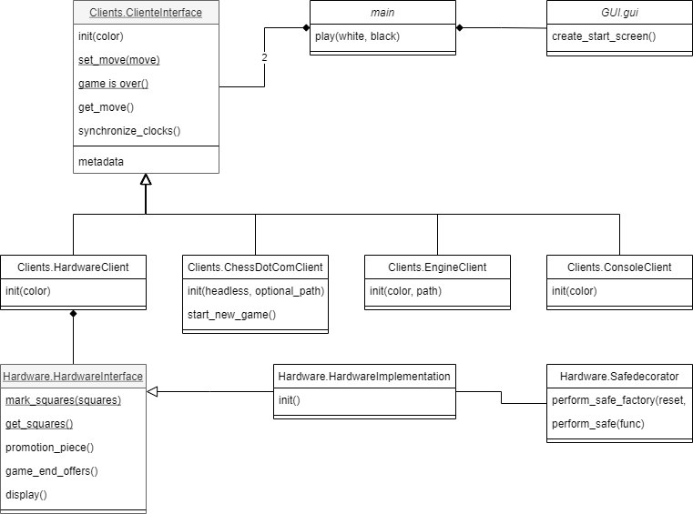

==================
Software structure
==================
In this section we will outline the structure and underlying ideas behind the software. Understanding this section is
vital to implement new features. The software is divided into 3 modules:

#. GUI
#. Software
#. Hardware

Each module will be explained in detail on this page. The class diagram below shows how all modules and files relate to
each other:

This page will go into all modules in detail.

Main module
===========
As the name implies the main module starts the program. The documentation of the of the main module can be found
:doc:`here <main>`. The main module contains only one method which is the :class:`main.play` method. This method accepts
two clients as input and starts a game between the two clients. One of the clients will be the
:class:`Hardware.HardwareClient` if the machine running the code supports the :class:`Hardware.HardwareClient`. If the
hardware is not supported then then the :class:`Hardware.ConsoleClient` will be started. This is mainly useful for
testing purposes. The second client given to the play method will be selected by the user using the GUI.

GUI module
==========
The GUI module is another simple module and the documentation can be found :doc:`here <GUI>`. This module contains a
very basic graphical user interface which allows the user to select the opponent he wishes to play against. The entrance
point is the method :class:`GUI.gui.get_opponent_from_gui`. This method starts the GUI and returns the opposing client.
Every screen can only be used once which is why we have to recreate every screen if the back button is pressed.

Clients module
==============
The Client module is the most important module in the project. New features will most likely need to be implemented in
this module. The class :class:`Clients.ClientInterface` is a vital class which defines the interface of all clients.
All other classes implement this interface. There are currently 4 clients:

#. :ref:`The chess.com client <Chess.com client>`
#. :ref:`The console client <Console client>`
#. :ref:`The engine client <Engine client>`
#. :ref:`The hardware client <Hardware client>`

Client interface
----------------
The documentation of this class can be found here :class:`here <Clients.ClientInterface>`. New programmers might not have
seen interfaces before and might be puzzled by their use. If you are familiar with interfaces then the
:class:`documentation  <Clients.ClientInterface>` will be sufficient to understand the interface. This section is aimed
for newer programmers which have not used interfaces yet.

In python we create an interface using something called abstract classes. These abstract class are not commonly used
within Python but they are very popular in other programming languages. Abstract classes are classes
which cannot be instantiated directly. Usually these abstract class will also contain abstract methods. If we want to
instantiate an abstract class then we first need to `implement` it. We implement a class by extending the abstract class
with a class which overwrites (ie. implements) all abstract methods. In Python code this looks like this:

.. code-block:: python

    from abc import ABC, abstractmethod

    class abstract_class(ABC):
        @abstractmethod
        def print_name(self):
            pass

    class implementation_1(abstract_class):

        def print_name(self):
            print("implementation 1")

    class implementation_2(abstract_class):

        def __init__(self, name):
            self._name = name

        def print_name(self):
            print(self._name)

Here the class `abstract_class` is the interface which has one method `print_name`. We can implement this class by extending
it and implementing the `print_name` method. In the example this class has been implemented twice. The first
implementation `implementation_1` simply prints the class name when the `print_name` method is called. The second
implementation `implementation_2` needs to be instantiated with a `name` parameter. When the `print_name` method is
called then this name is printed.

Now that we understand how to use abstract methods we might ask why we use these abstract classes. We can create
new methods which use the `abstract_class` interface. These methods can call the `print_name` method without knowing
how the method is implemented. An example of such a method can be found below:

.. code-block:: python

    from typing import list

    def print_names(objects: list[abstract_class]):
        for object in objects:
            object.print_name()

This method accepts a list of objects as input. These objects are either instances of `implementation_1` or
`implementation_2`. Because of the `abstract_class` interface we are sure that both classes implement the `print_name`
method. We can call this method without knowing how the method is implemented.

The :class:`Clients.ClientInterface` interface is used similarly. Because of the interface we can easily
implement different ways to play against the board using one piece of code. Next to this the interface allows us to
create new clients without changing the existing code. The :class:`Clients.ClientInterface` has two abstract methods
which need to be implemented. These methods are :class:`get_move <Clients.ClientInterface.ClientInterface.get_move>` and
:class:`set_move <Clients.ClientInterface.ClientInterface.set_move>`. The use of these classes speaks for itself. Next
to this the interface also contains normal methods. These methods are optional and do not need to be implemented.
If you do not implement these methods then the clients will use the base implementation from the abstract class. Next to
this the abstract class also contains public and private variables:

1. `_board`: This internal variable is of type `chess.Board` from the
`chess <https://python-chess.readthedocs.io/en/latest/>`_ library. This variable contains the current state of the
chess board.

2. `_resigned`: This variable is set to `True` if the client has resigned. This method is used in the base implementation
of the method :class:`game_is_over <Clients.ClientInterface.ClientInterface.game_is_over>`.

3. `color`: This public variable indicates the color of the
client.

4. `metadata`: This public variable is a dictionary where the keys and values are both strings. This variable can be used
to share some extra information like the players name. Make sure that no clients make assumptions about the content of this
variable to ensure that all clients are compatible.

Lastly, note that if an `__init__` method is implemented then the implementation should also call the original `__init__`
implementation. This can be done using the python code:

.. code-block:: python

    super().__init__(color)

Chess.com client
----------------
The documentation of this class can be found :class:`here <Clients.ChessDotComClient>`. This client retrieves the
opponents moves from a `chess.com <chess.com>`_ game and can play moves back. This class is made using the test software
`selenium <https://selenium-python.readthedocs.io/index.html>`_. In order to use this software the chrome driver needs
to be installed on the controller. Selenium interacts with the chess.com site by locating elements by id. The software
can then, read, click or drag these elements. Please note that changing the theme of
the chess.com site can change the name of elements on the site and break the software. The chess.com client assumes that
the default theme on chess.com is used and draw / resignation confirmation is turned off. This client is the most hardware
intensive and sensitive to software changes. Starting up the chrome driver has a large overhead and logging in takes a lot
of time. This is why the `chess.com client` is the only client which can be reused. The
:class:`start_new_game <Clients.ChessDotComClient.ChessDotComClient.start_new_game>` method resets the client and allows us
to reuse the client for a new game.

Console client
--------------
The documentation of this class can be found :class:`here <Clients.ConsoleClient>`. The console client is a very
simple implementation of the client interface and is very useful for testing. This client parses moves from the console
and prints the current board state after a move is received. The input format is `<from_square><to_square>` ie,
`e2e4` plays (pawn) from `e2` to `e4`. Next to this the client also supports resignation (`resign`), draw offers
(`draw <from_square><to_square>`) and promotions (`e7e8n`, promotes the e pawn to a knight). Note that draw offers are
only returned while playing a move. You cannot offer a draw during your or your opponents turn.

Engine client
-------------
The documentation of this class can be found :class:`here <Clients.EngineClient>`. This client accepts a path to the
a chess engine as input. The Smart chess board project relies on the
`chess <https://python-chess.readthedocs.io/en/latest/>`_ library. This library contains built in engine support.
Because of this the implementation of this client is trivial. The strength of the engine can be configured
by setting the time the engine has to think about a move. We do not allow the engine to think during the opponents turn.

Hardware client
---------------
The documentation of this class can be found :class:`here <Clients.HardwareClient>`. This client connects the project
to the hardware. The hardware is controlled using the :class:`Hardware.HardwareInterface` interface. Internally the
hardware client creates a new thread to control the hardware. Because of the complexity of this class experience using
threading is required to modify it. In this section I will assume you are familiar with threading and mutex locks. Note
that unit tests are available in the tests directory.

In this client we distinguish between two threads. The `main` thread and the `hardware` thread. The `main` thread is the
thread runs the main method. This thread calls the methods from the :class:`Clients.ClientInterface`. The `main` thread
communicates with the `hardware` thread using the private variables of the hardware client. In order to ensure thread
safety mutex locks are used. In order to prevent deadlocks any tread can only control at most one lock at every time. The
second thread is the `hardware` thread. This thread is responsible for controlling the hardware. In order to ensure
thread safety the `main` thread will never call the hardware interface or interact with the hardware in any another way.
The hardware `thread` can be in 3 states:

1. Detect player move: The state of the chess board is stored in the `_board` variable. From this state we can predict
which squares should be occupied and which squares should be empty. We mark every square on the hardware which is not in
the expected state. If exactly two squares are not in the expected state then we try to see if this represents a valid
move. In this is the case then we place the new move in the `_input_playResult` variable and we move to state 2.
In order to ensure thread safety the deep copy method is used to prevent pointers to shared memory leaving the hardware
client.

2. Wait opponent move: In this state we wait until the `set_move` method is called. Next to this we highlight
differences between the expected occupancy of the board and the actual occupancy of the hardware. Note that this might
include part of the last move. As an example, let the hardware client be white and play a move which captures a black
piece. This move is played by first removing the white piece and then removing the black piece. This results in two
squares with a different occupancy so the move is detected. However the white piece still needs to be placed down. That
is highlighted in this state. The expected occupancy is calculated by the
`chess <https://python-chess.readthedocs.io/en/latest/>`_ library. Once the `set_move` method is called by the main thread
we move from state 2 to state 3.

3. Play opponent move: In this state we wait until the user plays the opponents move on the hardware. The
`set_move` method uses deep copy to places the opponent move in the `_output_playResult` variable. Using the
`chess <https://python-chess.readthedocs.io/en/latest/>`_ library we find the new expected occupancy. Once again we
highlight the difference between the expected occupancy and the actual occupancy. Once the user has played the move and
the occupancies are the same we move back to state 1.

The `hardware` thread keeps looping between these states until the `__del__` method is called. The `__del__` method terminates
the `hardware` thread. Once the hardware thread has terminated then the hardware client can be destroyed.

Hardware module
===============
The last module is the hardware module. The documentation of the Hardware module can be found here
:doc:`Hardware`. The Hardware module has already been covered in great detail on
:doc:`this page <InterfaceImplementation>`. To summarise the module contains 3 files:

1. :class:`HardwareInterface <Hardware.HardwareInterface>`: This method defines the interface of the Hardware. This allows
us to use the :class:`Clients.HardwareClient` with any hardware setup.

2. :class:`HardwareImplementation <Hardware.HardwareImplementation>`: This class is implements the hardware interface
and is specific to hardware setup.

3. :class:`HardwareImplementation <Hardware.HardwareImplementation>`: This module contains useful resources to simplify
the hardware implementation.
