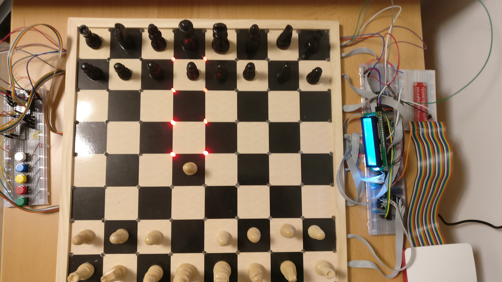

Goal of the project
=============================================

.. toctree::
   :maxdepth: 2
   :caption: Contents:

Smart chessboards are popular DIY projects for hardware and software enthusiasts. One great advantage of a DIY
chess board project is that lot of resources are available to assist people with the hardware design. This makes the
project accessible to people of any skill level. Unfortunately, there are few resources to assist people in the software
design. Most projects only treat the software as an after thought and very few features are implemented. This project
aims to change that. This software project contains a concise and well documented software framework for a DIY chessboard.
The framework contains out of the box functionality which allows players to connect the board to
`chess.com <chess.com>`_ or to play against an engine. The software works with any hardware setup and is accessible to
people of any skill level. No software development or Python experience is needed. Next to this the project is easily
extendable so new ideas can easily be implemented. This documentation will guide you trough all steps needed to connect
your chessboard. Next to this the inner structure of software is also well documented. The documentation of the inner
software is only needed if you are planning to implement new features. If you implement any features worth sharing
please share them with the community.

.. image:: img/engine_gui.png
   :width: 450
   :align: center

Project requirements
--------------------
The project has been designed to be usable for any hardware setup. The only requirement is that the controller (the
device running the code) supports python. The software can be pulled from github::

    git clone https://github.com/WouterSchols/SmartChessboard.git

All Python dependencies for the project can then be installed by calling pip from the root directory.::

    cd SmartChessboard
    pip install .

The hardware of the project will need to be linked with this software project.  This can be done by implementing
the :class:`HardwareInterface <Hardware.HardwareInterface>`. Detailed instructions and the interface specification
can be found here :doc:`here <InterfaceImplementation>`.

There are various ways to play on the hardware. We call these options to play against the hardware clients. Some clients
require some small extra dependencies. In order to play on `chess.com <chess.com>`_ one will also need to download the
`chrome driver <https://chromedriver.chromium.org/>`_. The chrome driver is a version of the chrome browser which can be
controlled using software. I have created the project on a Raspberry pi 3B+, chrome driver for
the raspberry pi can be downloaded using the command::

    sudo apt-get install chromium-chromedriver

A second client is the engine client. This client allows you to play against an engine. This client works with any installed
engine. The most commonly used engine is `stockfish <https://stockfishchess.org/download/>`_. On the Raspberry Pi the
software can be installed using the following commands::

    git clone https://github.com/official-stockfish/Stockfish
    cd Stockfish/src
    sudo make -j4 profile-build ARCH=armv7

This will fetch the latest version of stockfish and compile it to be efficient on the hardware.

Documentation contents
----------------------
.. toctree::
    Linking the hardware with the software <InterfaceImplementation>
    Hardware description <HardwareDescription>
    Software architecture description <Software>
    Software documentation <SoftwareDocumentation>

